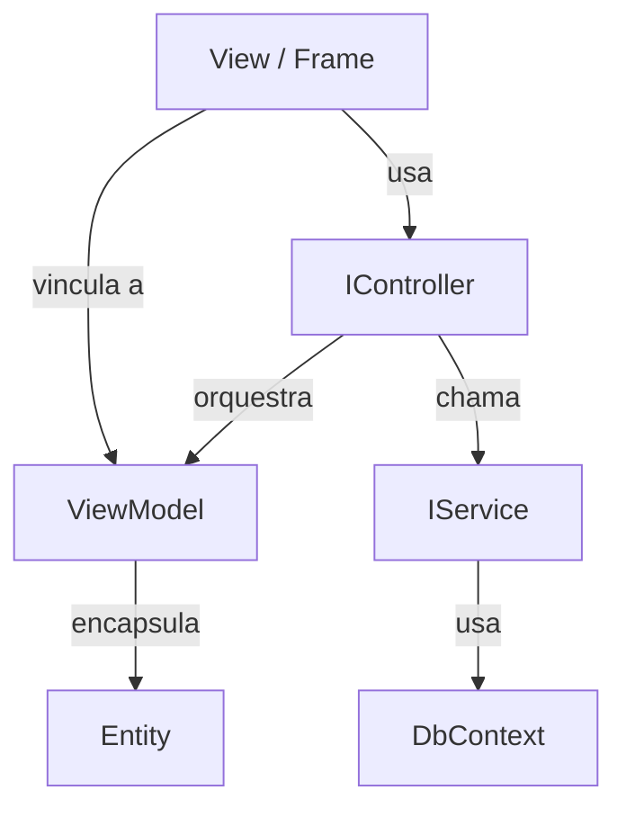

# Padrões MVVM

> Arquitetura limpa para aplicações desktop testáveis.

---

## Visão Geral

Dext.UI promove padrões MVVM (Model-View-ViewModel) e similares a MVC para aplicações desktop. Este guia cobre a arquitetura recomendada.

---

## Diagrama de Arquitetura



---

## O ViewModel

### Propósito

O ViewModel encapsula uma entidade e adiciona:
- Lógica de validação
- Coleção de erros
- Estado específico da UI (IsNew, IsDirty)

### Implementação

```pascal
type
  TCustomerViewModel = class
  private
    FCustomer: TCustomer;
    FErrors: TStrings;
    FOwnsCustomer: Boolean;
  public
    constructor Create;
    destructor Destroy; override;
    
    procedure Load(Customer: TCustomer; AOwnsCustomer: Boolean = False);
    procedure Clear;
    function Validate: Boolean;
    function GetEntity: TCustomer;
    procedure ReleaseOwnership;
    
    // Propriedades bindáveis
    property Id: Integer read GetId;
    property Name: string read GetName write SetName;
    property Email: string read GetEmail write SetEmail;
    property IsNew: Boolean read GetIsNew;
    property Errors: TStrings read FErrors;
  end;
```

### Padrão de Validação

Use classes de regras dedicadas:

```pascal
function TCustomerViewModel.Validate: Boolean;
var
  ErrorArray: TArray<string>;
begin
  FErrors.Clear;
  Result := TCustomerRules.ValidateAll(FCustomer, ErrorArray);
  for S in ErrorArray do
    FErrors.Add(S);
end;
```

---

## O Controller

### Propósito

Controllers orquestram a lógica de negócio entre View e Services. Eles:
- Tratam ações do usuário
- Coordenam carregamento de dados
- Gerenciam navegação

### Implementação

```pascal
type
  ICustomerController = interface
    procedure SetView(View: ICustomerView);
    procedure LoadCustomers;
    procedure CreateNewCustomer;
    procedure EditCustomer(Id: Integer);
    procedure SaveCustomer;
    procedure DeleteCustomer(Id: Integer);
    procedure CancelEdit;
  end;

  TCustomerController = class(TInterfacedObject, ICustomerController)
  private
    FService: ICustomerService;
    FLogger: ILogger;
    FView: ICustomerView;
    FViewModel: TCustomerViewModel;
  public
    constructor Create(Service: ICustomerService; Logger: ILogger);
    
    // ICustomerController
    procedure SetView(View: ICustomerView);
    procedure LoadCustomers;
    procedure CreateNewCustomer;
    // ...
  end;
```

### Registro no DI

```pascal
Services.AddScoped<ICustomerController, TCustomerController>;
```

---

## A Interface da View

### Propósito

Desacopla o Controller da implementação concreta da UI. Permite testes unitários com mocks.

### Implementação

```pascal
type
  {$M+}
  ICustomerView = interface
    ['{...}']
    procedure ShowListView;
    procedure ShowEditView(ViewModel: TCustomerViewModel);
    procedure RefreshList(Customers: IList<TCustomer>);
    procedure ShowError(const Msg: string);
    procedure ShowSuccess(const Msg: string);
  end;
  {$M-}
```

> **Nota:** Use `{$M+}` para interfaces que serão mockadas.

### Implementação no Form

```pascal
type
  TMainForm = class(TForm, ICustomerView)
  private
    FController: ICustomerController;
  public
    // ICustomerView
    procedure ShowListView;
    procedure ShowEditView(ViewModel: TCustomerViewModel);
    procedure RefreshList(Customers: IList<TCustomer>);
    // ...
  end;
```

---

## Testes Unitários

### Mockando Dependências

```pascal
[TestFixture('Customer Controller')]
TCustomerControllerTests = class
private
  FServiceMock: Mock<ICustomerService>;
  FViewMock: Mock<ICustomerView>;
  FController: ICustomerController;
public
  [Setup]
  procedure Setup;
  
  [Test]
  procedure TestLoadCustomers_CallsService;
end;

procedure TCustomerControllerTests.Setup;
begin
  FServiceMock := Mock<ICustomerService>.Create;
  FViewMock := Mock<ICustomerView>.Create;
  
  FController := TCustomerController.Create(
    FServiceMock.Instance, 
    Mock<ILogger>.Create.Instance
  );
  FController.View := FViewMock.Instance;
end;

procedure TCustomerControllerTests.TestLoadCustomers_CallsService;
var
  Customers: IList<TCustomer>;
begin
  // Arrange
  Customers := TCollections.CreateList<TCustomer>;
  FServiceMock.Setup.Returns(TValue.From(Customers)).When.GetAll;
  
  // Act
  FController.LoadCustomers;
  
  // Assert
  FServiceMock.Received.GetAll;
  FViewMock.Received.RefreshList(Arg.Any<IList<TCustomer>>);
end;
```

---

## Regras de Negócio

### Classe de Regras Separada

```pascal
type
  TCustomerRules = class
  public
    class function ValidateName(const Name: string; 
      out ErrorMsg: string): Boolean;
    class function ValidateEmail(const Email: string; 
      out ErrorMsg: string): Boolean;
    class function ValidateAll(const Customer: TCustomer;
      out Errors: TArray<string>): Boolean;
  end;
```

### Testando Regras

```pascal
[TestFixture('Customer Rules')]
TCustomerRulesTests = class
public
  [Test]
  procedure TestValidateName_Empty_Fails;
  
  [Test]
  procedure TestValidateName_Valid_Passes;
end;

procedure TCustomerRulesTests.TestValidateName_Empty_Fails;
var
  ErrorMsg: string;
begin
  Should(TCustomerRules.ValidateName('', ErrorMsg)).BeFalse;
  Should(ErrorMsg).Contain('required');
end;
```

---

## Estrutura do Projeto

Organize por feature, não por camada:

```
Features/
├── Customers/
│   ├── Customer.Entity.pas
│   ├── Customer.Service.pas
│   ├── Customer.Controller.pas
│   ├── Customer.ViewModel.pas
│   ├── Customer.Rules.pas
│   ├── Customer.List.pas       (Frame)
│   └── Customer.Edit.pas       (Frame)
├── Products/
│   └── ...
└── Layout/
    └── Main.Form.pas
```

---

## Veja Também

- [Navigator Framework](navigator.md) - Navegação de views
- [Magic Binding](magic-binding.md) - Binding de UI
- [Guia de Testes](../08-testes/README.md) - Testes unitários com mocks
