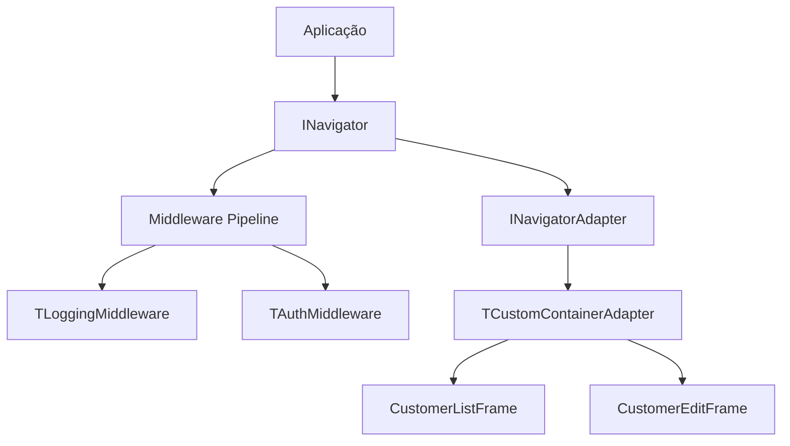

# Navigator Framework

> Navegação inspirada no Flutter para aplicações desktop VCL.

---

## Visão Geral

O Navigator fornece uma abstração limpa para gerenciamento de views em aplicações desktop. Ao invés de manualmente mostrar/esconder forms ou frames, você usa uma API declarativa com suporte a middleware.

## Conceitos Principais



---

## Uso Básico

### Configuração

```pascal
// No App Startup
Navigator := TSimpleNavigator.Create;
Navigator.UseAdapter(TCustomContainerAdapter.Create(ContentPanel));
```

### Métodos de Navegação

```pascal
// Push uma nova view na pilha
Navigator.Push(TCustomerListFrame);

// Pop a view atual, retorna para a anterior
Navigator.Pop;

// Substitui a view atual
Navigator.Replace(TNewView);

// Pop até um tipo específico de view
Navigator.PopUntil(THomeView);
```

---

## Passando Dados

```pascal
// Push com dados de contexto
Navigator.Push(TCustomerEditFrame, TValue.From(Customer));

// No frame de destino - implemente INavigationAware
procedure TCustomerEditFrame.OnNavigatedTo(const Context: TNavigationContext);
begin
  if Context.HasValue then
    LoadCustomer(Context.Value.AsType<TCustomer>);
end;
```

---

## Middlewares

Middlewares interceptam requisições de navegação, permitindo adicionar preocupações transversais.

### Middleware de Logging

```pascal
type
  TLoggingMiddleware = class(TInterfacedObject, INavigationMiddleware)
  private
    FLogger: ILogger;
  public
    constructor Create(Logger: ILogger);
    function Execute(const Context: TNavigationContext; 
      Next: TNavigationDelegate): TNavigationResult;
  end;

function TLoggingMiddleware.Execute(const Context: TNavigationContext;
  Next: TNavigationDelegate): TNavigationResult;
begin
  FLogger.Info('Navegando para: %s', [Context.TargetViewClass.ClassName]);
  Result := Next(Context);
  FLogger.Debug('Navegação concluída');
end;
```

### Middleware de Auth Guard

```pascal
type
  TAuthMiddleware = class(TInterfacedObject, INavigationMiddleware)
  private
    FAuthService: IAuthService;
  public
    function Execute(const Context: TNavigationContext;
      Next: TNavigationDelegate): TNavigationResult;
  end;

function TAuthMiddleware.Execute(const Context: TNavigationContext;
  Next: TNavigationDelegate): TNavigationResult;
begin
  if not FAuthService.IsAuthenticated then
  begin
    Result := TNavigationResult.Blocked('Não autenticado');
    Exit;
  end;
  Result := Next(Context);
end;
```

### Usando Middlewares

```pascal
Navigator
  .UseMiddleware(TLoggingMiddleware.Create(Logger))
  .UseMiddleware(TAuthMiddleware.Create(AuthService))
  .UseMiddleware(TRoleMiddleware.Create(AuthService, 'Admin'));
```

---

## Adapters

Adapters determinam COMO as views são exibidas. O Navigator é agnóstico a adapters.

### Container Adapter

Embute frames dentro de um painel container:

```pascal
Navigator.UseAdapter(TCustomContainerAdapter.Create(ContentPanel));
```

### PageControl Adapter

Usa tabs para navegação:

```pascal
Navigator.UseAdapter(TPageControlAdapter.Create(PageControl1));
```

### MDI Adapter

Cria janelas filhas MDI:

```pascal
Navigator.UseAdapter(TMDIAdapter.Create(Application));
```

---

## Hooks de Ciclo de Vida

Implemente `INavigationAware` para receber eventos de navegação:

```pascal
type
  TCustomerEditFrame = class(TFrame, INavigationAware)
  public
    procedure OnNavigatedTo(const Context: TNavigationContext);
    procedure OnNavigatedFrom;
  end;

procedure TCustomerEditFrame.OnNavigatedTo(const Context: TNavigationContext);
begin
  // Inicializa a view, carrega dados do contexto
end;

procedure TCustomerEditFrame.OnNavigatedFrom;
begin
  // Cleanup, salva estado se necessário
end;
```

---

## Integração com DI

```pascal
// Registrar no container DI
Services.AddSingleton<ISimpleNavigator>(
  function: ISimpleNavigator
  begin
    Result := TSimpleNavigator.Create;
    Result.UseAdapter(TCustomContainerAdapter.Create(MainForm.ContentPanel));
  end);

// Injetar em controllers
constructor TMainController.Create(Navigator: ISimpleNavigator);
begin
  FNavigator := Navigator;
end;
```

---

## Veja Também

- [Magic Binding](magic-binding.md) - Binding de UI
- [Padrões MVVM](mvvm-patterns.md) - Guia de arquitetura
- [Exemplo CustomerCRUD](../../../Examples/Desktop.MVVM.CustomerCRUD/)
