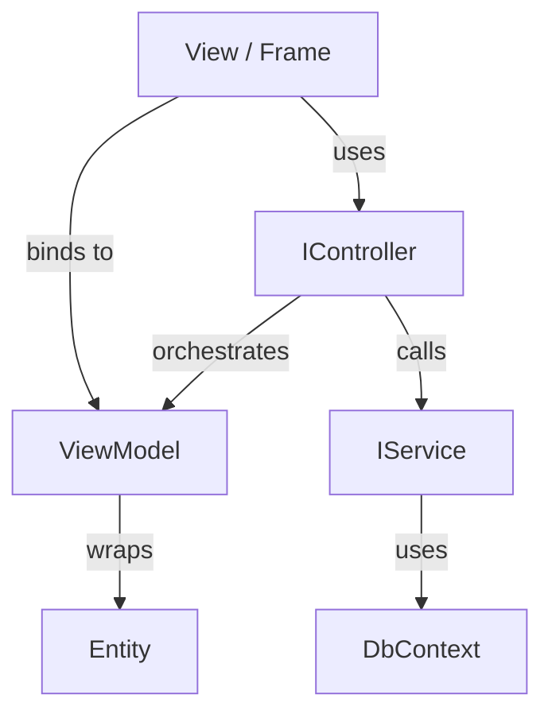

# MVVM Patterns

> Clean architecture for testable desktop applications.

---

## Overview

Dext.UI promotes MVVM (Model-View-ViewModel) and MVC-like patterns for desktop apps. This guide covers the recommended architecture.

---

## Architecture Diagram



---

## The ViewModel

### Purpose

The ViewModel wraps an entity and adds:
- Validation logic
- Error collection
- UI-specific state (IsNew, IsDirty)

### Implementation

```pascal
type
  TCustomerViewModel = class
  private
    FCustomer: TCustomer;
    FErrors: TStrings;
    FOwnsCustomer: Boolean;
  public
    constructor Create;
    destructor Destroy; override;
    
    procedure Load(Customer: TCustomer; AOwnsCustomer: Boolean = False);
    procedure Clear;
    function Validate: Boolean;
    function GetEntity: TCustomer;
    procedure ReleaseOwnership;
    
    // Bindable properties
    property Id: Integer read GetId;
    property Name: string read GetName write SetName;
    property Email: string read GetEmail write SetEmail;
    property IsNew: Boolean read GetIsNew;
    property Errors: TStrings read FErrors;
  end;
```

### Validation Pattern

Use dedicated rules classes:

```pascal
function TCustomerViewModel.Validate: Boolean;
var
  ErrorArray: TArray<string>;
begin
  FErrors.Clear;
  Result := TCustomerRules.ValidateAll(FCustomer, ErrorArray);
  for S in ErrorArray do
    FErrors.Add(S);
end;
```

---

## The Controller

### Purpose

Controllers orchestrate business logic between View and Services. They:
- Handle user actions
- Coordinate data loading
- Manage navigation

### Implementation

```pascal
type
  ICustomerController = interface
    procedure SetView(View: ICustomerView);
    procedure LoadCustomers;
    procedure CreateNewCustomer;
    procedure EditCustomer(Id: Integer);
    procedure SaveCustomer;
    procedure DeleteCustomer(Id: Integer);
    procedure CancelEdit;
  end;

  TCustomerController = class(TInterfacedObject, ICustomerController)
  private
    FService: ICustomerService;
    FLogger: ILogger;
    FView: ICustomerView;
    FViewModel: TCustomerViewModel;
  public
    constructor Create(Service: ICustomerService; Logger: ILogger);
    
    // ICustomerController
    procedure SetView(View: ICustomerView);
    procedure LoadCustomers;
    procedure CreateNewCustomer;
    // ...
  end;
```

### DI Registration

```pascal
Services.AddScoped<ICustomerController, TCustomerController>;
```

---

## The View Interface

### Purpose

Decouples Controller from concrete UI implementation. Enables unit testing with mocks.

### Implementation

```pascal
type
  {$M+}
  ICustomerView = interface
    ['{...}']
    procedure ShowListView;
    procedure ShowEditView(ViewModel: TCustomerViewModel);
    procedure RefreshList(Customers: IList<TCustomer>);
    procedure ShowError(const Msg: string);
    procedure ShowSuccess(const Msg: string);
  end;
  {$M-}
```

> **Note:** Use `{$M+}` for interfaces that will be mocked.

### Form Implementation

```pascal
type
  TMainForm = class(TForm, ICustomerView)
  private
    FController: ICustomerController;
  public
    // ICustomerView
    procedure ShowListView;
    procedure ShowEditView(ViewModel: TCustomerViewModel);
    procedure RefreshList(Customers: IList<TCustomer>);
    // ...
  end;
```

---

## Unit Testing

### Mocking Dependencies

```pascal
[TestFixture('Customer Controller')]
TCustomerControllerTests = class
private
  FServiceMock: Mock<ICustomerService>;
  FViewMock: Mock<ICustomerView>;
  FController: ICustomerController;
public
  [Setup]
  procedure Setup;
  
  [Test]
  procedure TestLoadCustomers_CallsService;
end;

procedure TCustomerControllerTests.Setup;
begin
  FServiceMock := Mock<ICustomerService>.Create;
  FViewMock := Mock<ICustomerView>.Create;
  
  FController := TCustomerController.Create(
    FServiceMock.Instance, 
    Mock<ILogger>.Create.Instance
  );
  FController.View := FViewMock.Instance;
end;

procedure TCustomerControllerTests.TestLoadCustomers_CallsService;
var
  Customers: IList<TCustomer>;
begin
  // Arrange
  Customers := TCollections.CreateList<TCustomer>;
  FServiceMock.Setup.Returns(TValue.From(Customers)).When.GetAll;
  
  // Act
  FController.LoadCustomers;
  
  // Assert
  FServiceMock.Received.GetAll;
  FViewMock.Received.RefreshList(Arg.Any<IList<TCustomer>>);
end;
```

---

## Business Rules

### Separate Rules Class

```pascal
type
  TCustomerRules = class
  public
    class function ValidateName(const Name: string; 
      out ErrorMsg: string): Boolean;
    class function ValidateEmail(const Email: string; 
      out ErrorMsg: string): Boolean;
    class function ValidateAll(const Customer: TCustomer;
      out Errors: TArray<string>): Boolean;
  end;
```

### Testing Rules

```pascal
[TestFixture('Customer Rules')]
TCustomerRulesTests = class
public
  [Test]
  procedure TestValidateName_Empty_Fails;
  
  [Test]
  procedure TestValidateName_Valid_Passes;
end;

procedure TCustomerRulesTests.TestValidateName_Empty_Fails;
var
  ErrorMsg: string;
begin
  Should(TCustomerRules.ValidateName('', ErrorMsg)).BeFalse;
  Should(ErrorMsg).Contain('required');
end;
```

---

## Project Structure

Organize by feature, not by layer:

```
Features/
├── Customers/
│   ├── Customer.Entity.pas
│   ├── Customer.Service.pas
│   ├── Customer.Controller.pas
│   ├── Customer.ViewModel.pas
│   ├── Customer.Rules.pas
│   ├── Customer.List.pas       (Frame)
│   └── Customer.Edit.pas       (Frame)
├── Products/
│   └── ...
└── Layout/
    └── Main.Form.pas
```

---

## See Also

- [Navigator Framework](navigator.md) - View navigation
- [Magic Binding](magic-binding.md) - UI data binding
- [Testing Guide](../08-testing/README.md) - Unit testing with mocks
