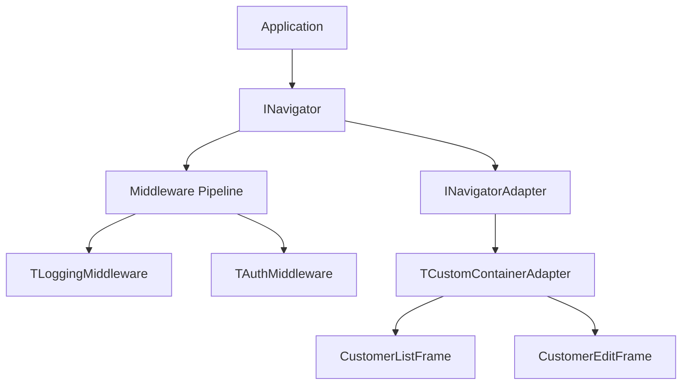

# Navigator Framework

> Flutter-inspired navigation for VCL desktop applications.

---

## Overview

The Navigator provides a clean abstraction for view management in desktop apps. Instead of manually showing/hiding forms or frames, you use a declarative API with middleware support.

## Core Concepts



---

## Basic Usage

### Setup

```pascal
// In App Startup
Navigator := TSimpleNavigator.Create;
Navigator.UseAdapter(TCustomContainerAdapter.Create(ContentPanel));
```

### Navigation Methods

```pascal
// Push a new view onto the stack
Navigator.Push(TCustomerListFrame);

// Pop current view, return to previous
Navigator.Pop;

// Replace current view
Navigator.Replace(TNewView);

// Pop until a specific view type
Navigator.PopUntil(THomeView);
```

---

## Passing Data

```pascal
// Push with context data
Navigator.Push(TCustomerEditFrame, TValue.From(Customer));

// In the target frame - implement INavigationAware
procedure TCustomerEditFrame.OnNavigatedTo(const Context: TNavigationContext);
begin
  if Context.HasValue then
    LoadCustomer(Context.Value.AsType<TCustomer>);
end;
```

---

## Middlewares

Middlewares intercept navigation requests, allowing you to add cross-cutting concerns.

### Logging Middleware

```pascal
type
  TLoggingMiddleware = class(TInterfacedObject, INavigationMiddleware)
  private
    FLogger: ILogger;
  public
    constructor Create(Logger: ILogger);
    function Execute(const Context: TNavigationContext; 
      Next: TNavigationDelegate): TNavigationResult;
  end;

function TLoggingMiddleware.Execute(const Context: TNavigationContext;
  Next: TNavigationDelegate): TNavigationResult;
begin
  FLogger.Info('Navigating to: %s', [Context.TargetViewClass.ClassName]);
  Result := Next(Context);
  FLogger.Debug('Navigation completed');
end;
```

### Auth Guard Middleware

```pascal
type
  TAuthMiddleware = class(TInterfacedObject, INavigationMiddleware)
  private
    FAuthService: IAuthService;
  public
    function Execute(const Context: TNavigationContext;
      Next: TNavigationDelegate): TNavigationResult;
  end;

function TAuthMiddleware.Execute(const Context: TNavigationContext;
  Next: TNavigationDelegate): TNavigationResult;
begin
  if not FAuthService.IsAuthenticated then
  begin
    Result := TNavigationResult.Blocked('Not authenticated');
    Exit;
  end;
  Result := Next(Context);
end;
```

### Using Middlewares

```pascal
Navigator
  .UseMiddleware(TLoggingMiddleware.Create(Logger))
  .UseMiddleware(TAuthMiddleware.Create(AuthService))
  .UseMiddleware(TRoleMiddleware.Create(AuthService, 'Admin'));
```

---

## Adapters

Adapters determine HOW views are displayed. The Navigator is adapter-agnostic.

### Container Adapter

Embeds frames inside a container panel:

```pascal
Navigator.UseAdapter(TCustomContainerAdapter.Create(ContentPanel));
```

### PageControl Adapter

Uses tabs for navigation:

```pascal
Navigator.UseAdapter(TPageControlAdapter.Create(PageControl1));
```

### MDI Adapter

Creates MDI child windows:

```pascal
Navigator.UseAdapter(TMDIAdapter.Create(Application));
```

---

## Lifecycle Hooks

Implement `INavigationAware` to receive navigation events:

```pascal
type
  TCustomerEditFrame = class(TFrame, INavigationAware)
  public
    procedure OnNavigatedTo(const Context: TNavigationContext);
    procedure OnNavigatedFrom;
  end;

procedure TCustomerEditFrame.OnNavigatedTo(const Context: TNavigationContext);
begin
  // Initialize the view, load data from context
end;

procedure TCustomerEditFrame.OnNavigatedFrom;
begin
  // Cleanup, save state if needed
end;
```

---

## Integration with DI

```pascal
// Register in DI container
Services.AddSingleton<ISimpleNavigator>(
  function: ISimpleNavigator
  begin
    Result := TSimpleNavigator.Create;
    Result.UseAdapter(TCustomContainerAdapter.Create(MainForm.ContentPanel));
  end);

// Inject into controllers
constructor TMainController.Create(Navigator: ISimpleNavigator);
begin
  FNavigator := Navigator;
end;
```

---

## See Also

- [Magic Binding](magic-binding.md) - UI data binding
- [MVVM Patterns](mvvm-patterns.md) - Architecture guide
- [CustomerCRUD Example](../../../Examples/Desktop.MVVM.CustomerCRUD/)
