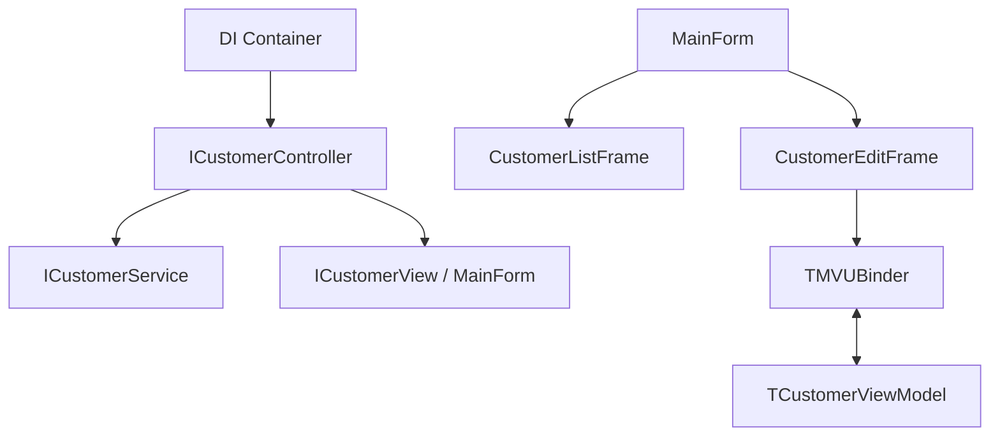

# 🏢 Desktop.Modern.CustomerCRUD

Exemplo de aplicação Desktop moderna usando Dext Framework, demonstrando padrões de desenvolvimento profissional, desacoplamento extremo e produtividade via Magic Binding.

## 🎯 O Que Este Exemplo Demonstra

| Recurso | Descrição |
|---------|-----------|
| **Controller Pattern** | Orquestração de lógica separada da View via Interface (`ICustomerController`) |
| **Magic Binding (UI)** | Binding bidirecional automático via Atributos (`[BindEdit]`, `[BindText]`, etc) |
| **Injeção de Dependência** | Services e Controllers injetados via DI Container |
| **Arquitetura Desacoplada** | Comunicação entre Controller e View via Interface (`ICustomerView`) |
| **ORM & Validação** | Entidades mapeadas com atributos e validação automática no ViewModel |
| **Logging** | Log de operações injetado e padronizado via ILogger |

## 📂 Estrutura do Projeto

## 📂 Estrutura do Projeto (Feature Folders)

Este exemplo utiliza a abordagem de **Feature Folders**, agrupando arquivos por funcionalidade de negócio em vez de tipo técnico. Isso melhora a coesão, facilita a manutenção e torna o projeto altamente escalável.

```
Desktop.Modern.CustomerCRUD/
├── App/
│   └── App.Startup.pas         # Configuração DI e Lifecycle
├── Features/
│   ├── Customers/              # Tudo sobre a funcionalidade de Clientes
│   │   ├── Customer.Entity.pas
│   │   ├── Customer.Service.pas
│   │   ├── Customer.Controller.pas
│   │   ├── Customer.ViewModel.pas
│   │   ├── Customer.List.pas
│   │   └── Customer.Edit.pas
│   └── Layout/                 # Estrutura base da aplicação
│       └── Main.Form.pas
├── Data/                       # Persistência e Contexto (infra)
└── DesktopModernCustomerCRUD.dpr
```

## 🧠 Decisões Arquiteturais: Por que Feature Folders?

Em projetos pequenos, a separação por pastas Técnicas (`Controllers/`, `Views/`, `Services/`) pode parecer organizada, mas gera a "Arquitetura Espalhada": para mexer em uma única funcionalidade, você navega por 5 pastas diferentes.

**Vantagens da abordagem adotada:**
- **Alta Coesão**: Se você precisar alterar algo em "Clientes", todos os arquivos relevantes estão em um só lugar.
- **Escalabilidade**: Adicionar uma nova feature (ex: "Produtos") é tão simples quanto criar uma nova subpasta em `Features/`.
- **Screaming Architecture**: A estrutura de pastas diz "o que o sistema faz" (Gestão de Clientes) em vez de apenas "quais ferramentas ele usa".
- **Facilidade de Remoção**: Se uma feature se tornar obsoleta, basta deletar uma única pasta.



## 🚀 Magic Binding (O "Pulo do Gato")

A grande inovação deste exemplo é o uso de **Atributos de UI**. Em vez de escrever centenas de linhas de código `Edit1.Text := ViewModel.Name`, você apenas decora seus componentes:

```pascal
[BindEdit('Name')]
NameEdit: TEdit;

[BindText('Errors.Text')]
ErrorsLabel: TLabel;

[OnClickMsg(TSaveMsg)]
SaveButton: TButton;
```

A sincronização de dados e o despacho de mensagens são tratados automaticamente pela engine `Dext.UI`.

---

## 🔧 Como Executar

1. Abra `DesktopModernCustomerCRUD.dproj` no Delphi.
2. Certifique-se de que os fontes do Dext Framework estão no Library Path.
3. Compile (Ctrl+F9) e Execute (F9).

---

## 🗺 Roadmap Futuro (Dext UI Evolution)

Ideias para aprimorar ainda mais a produtividade do framework demonstrado aqui:

- [ ] **Grid Binder**: Implementar um `[BindGrid]` ou `[BindItems]` que sincronize automaticamente uma `IList<T>` com um `TStringGrid` ou `TListView`, eliminando o preenchimento manual de loops.
- [ ] **Validation Interceptors**: Permitir que atributos de validação no Model mudem a cor das bordas dos componentes `TEdit` automaticamente quando houver erros.
- [ ] **Navigation Service**: Um serviço de navegação centralizado para gerenciar a troca de Frames sem que o `MainForm` precise conhecer todos eles.

---

*Dext Framework - Modern Desktop Development for Delphi*
